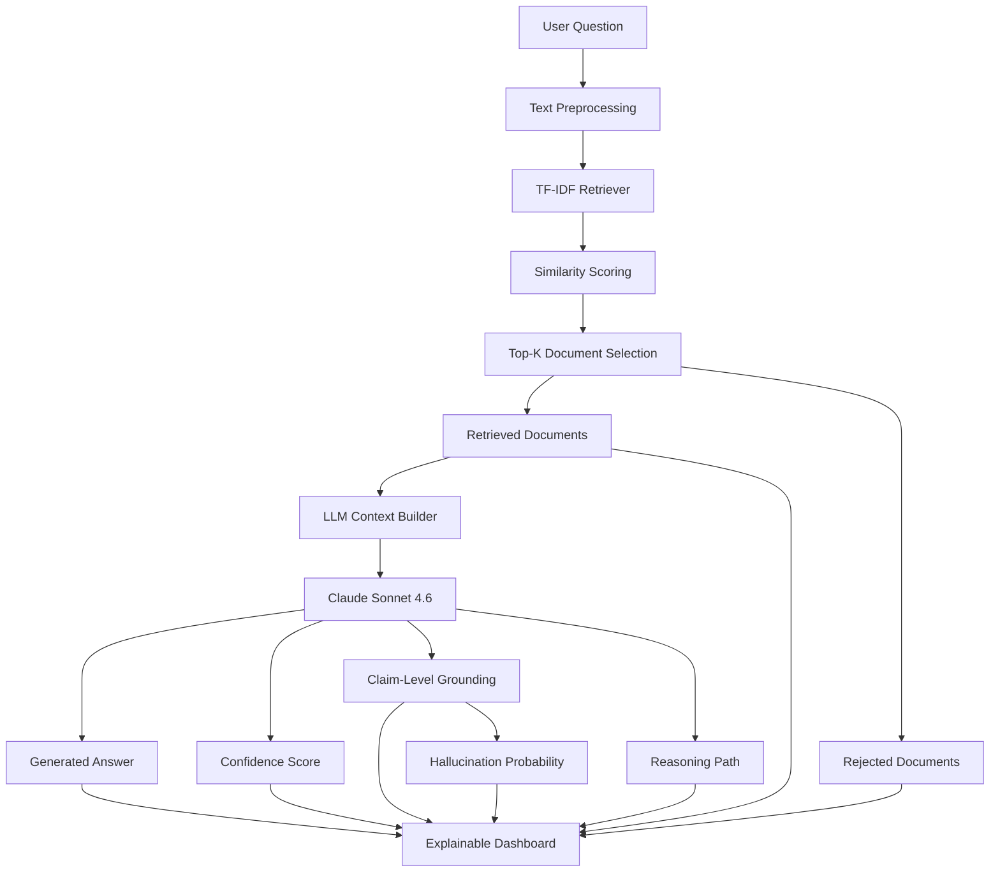

```mermaid
flowchart TD

A[User Question]
B[Text Preprocessing]
C[TF-IDF Retriever]
D[Similarity Scoring]
E[Top-K Document Selection]

F[Retrieved Documents]
G[Rejected Documents]

H[LLM Context Builder]
I[Claude Sonnet 4.6]

J[Generated Answer]
K[Confidence Score]
L[Claim-Level Grounding]
M[Hallucination Probability]
N[Reasoning Path]

O[Explainable Dashboard]

A --> B
B --> C
C --> D
D --> E

E --> F
E --> G

F --> H
H --> I

I --> J
I --> K
I --> L
I --> N

L --> M

J --> O
K --> O
L --> O
M --> O
N --> O
F --> O
G --> O
```
